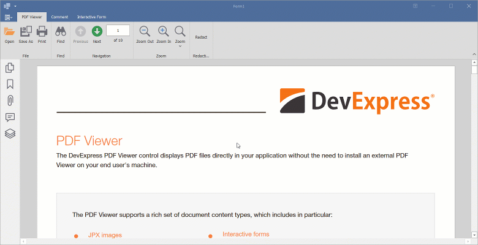

<!-- default badges list -->

<!-- default badges end -->
# PDF Viewer for WinForms - Add Redaction Annotations by Coordinates Obtained from the Viewer

The DevExpress WinForms PDF Viewer allows you to create redaction annotations within a specified PDF file region. In this example, a rectangle is drawn in the selection area. Click the **Redact** button to add a redaction annotation to the drawn rectangle.

>[!important]
> You need an active [DevExpress Office File API Subscription](https://www.devexpress.com/products/net/office-file-api/) or [DevExpress Universal Subscription](https://www.devexpress.com/subscriptions/universal.xml) to use PDF Graphics and Facade API in production code.

## Implementation Details

Selection area coordinates are obtained through `MouseUp`, `MouseMove`, and `MouseDown` event handlers. Drawing the rectangle is handled within the `PdfViewerControl.Paint` event handler. A `PdfDocumentFacade` instance of the active page is obtained in the `ButtonClick` event handler. A `AddRedactAnnotation` method call generates a redaction annotation over the rectangle. An `ApplyRedactAnnotations` method call applies the annotation.

## Files to Review

* [Form1.cs](./CS/DXApplication1/Form1.cs) (VB: [Form1.vb](./VB/DXApplication1/Form1.vb))

## More Examples

* [How to: Draw Graphics by Coordinates Obtained from the PDF Viewer](https://github.com/DevExpress-Examples/how-to-custom-draw-in-pdf-viewer)

## Documentation

* [How to: Use PDF Facade API to Manage Annotations in PDF Viewer for WinForms](https://docs.devexpress.com/WindowsForms/403206/controls-and-libraries/pdf-viewer/examples/pdf-facade-api/how-to-organize-annotations)
<!-- feedback -->
## Does this example address your development requirements/objectives?

 

(you will be redirected to DevExpress.com to submit your response)
<!-- feedback end -->
